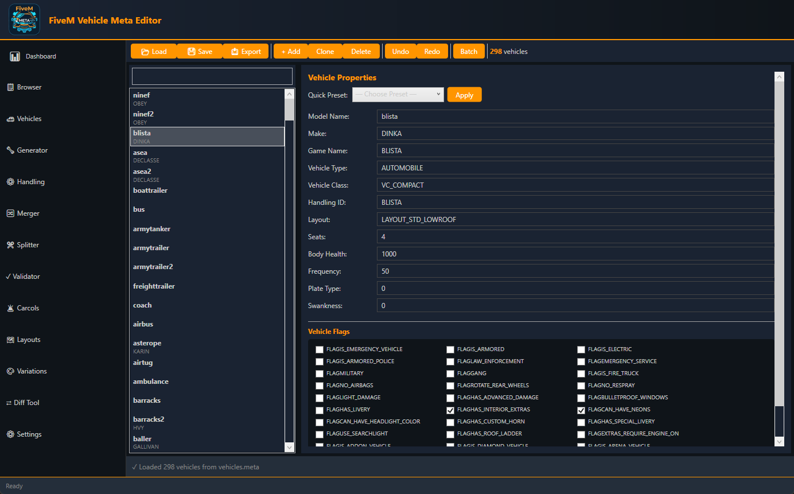
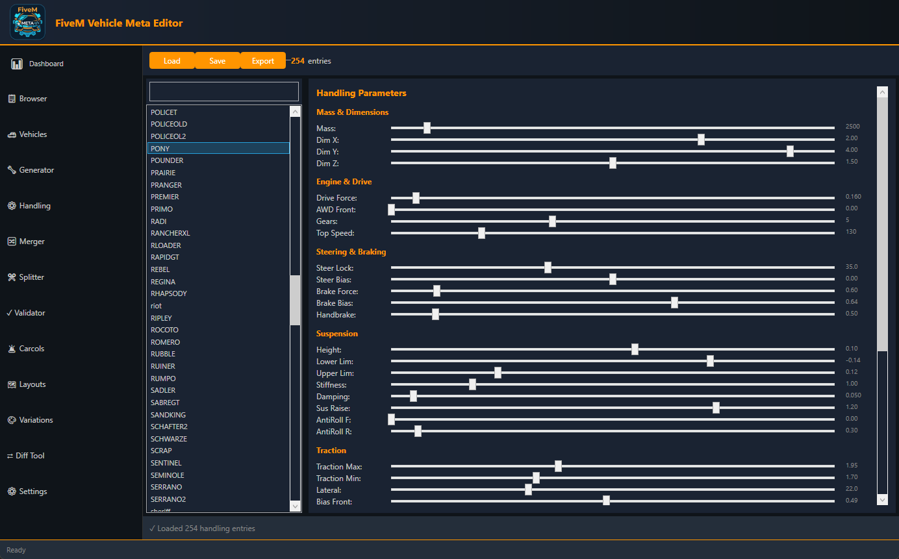

<div align="center">
  
  <h1>FiveM Vehicle Meta Editor</h1>
  <p><strong>A powerful WPF-based editor for GTA V FiveM vehicle metadata files</strong></p>
  <p>
    <a href="https://github.com/D4rkst3r/FiveMVehicleMetaEditor/releases">📥 Download</a> •
    <a href="#features">✨ Features</a> •
    <a href="#installation">⚡ Install</a> •
    <a href="#usage">📖 Guide</a> •
    <a href="#license">📄 License</a>
  </p>
</div>

---

A powerful WPF-based editor for GTA V FiveM vehicle metadata files (`vehicles.meta`, `handling.meta`, `carvariations.meta`, etc.).

## 🖼️ Screenshots

| Dashboard | Vehicles Editor | Handling Parameters |
|-----------|-----------------|-------------------|
|  |  |  |

| Settings | Browser | Merger |
|----------|---------|--------|
|  |  |  |

## Features

✨ **12 Specialized Tabs:**
- 📊 Dashboard - Overview and statistics
- 📋 Browser - File browser and recent files
- 🚗 Vehicles - Edit vehicle properties
- 🔧 Generator - Generate new vehicles
- ⚙️ Handling - Vehicle handling parameters
- 🔀 Merger - Merge multiple meta files
- ✂️ Splitter - Split meta files
- ✓ Validator - Validate file integrity
- 🚨 Carcols - Vehicle color palettes
- 🗺️ Layouts - Vehicle layouts editor
- 🎨 Variations - Vehicle variations and liveries
- ⚙️ Settings - Application configuration

🎨 **Modern Dark Theme:**
- Orange primary color (#FF9500)
- Cyan secondary color (#00D4FF)
- Fully responsive UI
- Live theme updates

📁 **File Management:**
- Auto-save functionality
- Automatic backups
- Recent files tracking
- Custom presets (JSON)
- Export/import profiles

⚡ **Advanced Features:**
- Real-time validation
- 199+ vehicle flags database
- Keyboard shortcuts (Ctrl+S, Ctrl+E, Ctrl+I, Ctrl+F)
- Batch operations (merge/split)
- Settings persistence

## Installation

1. Download the latest release from [Releases](https://github.com/D4rkst3r/FiveMVehicleMetaEditor/releases)
2. Extract the ZIP file
3. Run `FiveMVehicleMetaEditorWPF.exe`

## Requirements

- Windows 7 or later
- .NET 10.0 (included in release)

## How to Use

### Loading Meta Files
1. Navigate to **📋 Browser** tab
2. Click **"📂 Load vehicles.meta"** to load vehicle data
3. Use **🚗 Vehicles** tab to edit

### Editing Vehicles
1. Select a vehicle from the left panel
2. Edit properties in the right panel
3. Changes apply immediately
4. Click **"💾 Save"** to persist

### Handling Parameters
1. Go to **⚙️ Handling** tab
2. Select a handling entry
3. Adjust sliders for mass, acceleration, steering, etc.
4. Click **"💾 Save"**

### Backup & Presets
1. Backups are automatically created before saving
2. Save custom presets in **🚗 Vehicles** tab
3. Restore from **⚙️ Settings** → Backup Location

### Keyboard Shortcuts
- **Ctrl+S** - Save
- **Ctrl+E** - Export
- **Ctrl+I** - Import
- **Ctrl+F** - Search/Filter

## Building from Source

### Requirements
- Visual Studio 2022 or later
- .NET 10.0 SDK
- Windows 10+ (for development)

### Build Steps
```bash
git clone https://github.com/D4rkst3r/FiveMVehicleMetaEditor.git
cd FiveMVehicleMetaEditor
dotnet build -c Release
dotnet publish -c Release -p:PublishProfile=FolderProfile
```

### Output
Release build: `bin/Release/net10.0-windows/`

## Project Structure

```
FiveMVehicleMetaEditorWPF/
├── Core/
│   ├── Models/              # Data structures
│   ├── Services/            # Business logic
│   │   ├── MetaVehiclesService.cs
│   │   ├── MetaHandlingService.cs
│   │   ├── BackupManager.cs
│   │   └── AppSettingsService.cs
│   ├── Constants.cs         # Vehicle data
│   └── Converters/          # XAML converters
├── Views/
│   ├── MainWindow.xaml
│   └── Tabs/                # 12 tab views
├── ViewModels/
│   ├── MainWindowViewModel.cs
│   └── TabViewModels/       # 12 tab viewmodels
├── Assets/                  # Icons & images
├── App.xaml                 # Theming & resources
└── README.md
```

## Contributing

Found a bug? Have a suggestion?
1. Open an [Issue](https://github.com/D4rkst3r/FiveMVehicleMetaEditor/issues)
2. Provide detailed description and steps to reproduce

## License

MIT License - See LICENSE file

## Credits

Made with 💚 for the FiveM Community

---

**Version:** 1.0.0  
**Last Updated:** 2026-05-04
