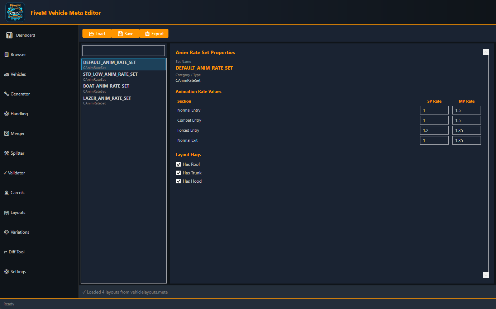

<div align="center">
  
  <h1>FiveM Vehicle Meta Editor</h1>
  <p><strong>A powerful WPF-based editor for GTA V / FiveM vehicle metadata files</strong></p>
  <p>
    <a href="https://github.com/D4rkst3r/FiveMVehicleMetaEditor/releases">Download</a> •
    <a href="#features">Features</a> •
    <a href="#installation">Install</a> •
    <a href="#usage">Guide</a> •
    <a href="#changelog">Changelog</a>
  </p>
</div>

---

Edit `vehicles.meta`, `handling.meta`, `carcols.meta`, `carvariations.meta` and `vehiclelayouts.meta` with a full-featured dark-theme WPF GUI. No XML editing required.


## 🖼️ Screenshots

| Layout | Vehicles Editor | Handling Parameters |
|-----------|-----------------|-------------------|
|  |  |  |


## Features

### 13 Tabs

| Tab | What it does |
|-----|-------------|
| Dashboard | Statistics overview, quick-access buttons |
| Browser | Load files, recent file history, quick navigation |
| Vehicles | Edit all vehicle properties, flags editor, presets, undo/redo, batch-edit, add/clone/delete |
| Generator | Create a complete vehicle from scratch — generates vehicles.meta + optional handling.meta / carcols.meta / fxmanifest.lua |
| Handling | Edit 35+ physics parameters with sliders + value boxes and parameter tooltips |
| Merger | Merge multiple meta files with conflict detection |
| Splitter | Split large files into per-vehicle folders |
| Validator | Validate XML syntax, required fields, duplicate IDs, cross-references |
| Carcols | Edit mod kits (add/delete/rename), view visible mods |
| Layouts | Edit seat/door layout AnimRateSets |
| Variations | Edit color palette indices per vehicle, add/delete variants |
| Diff Tool | Compare two vehicles.meta files side-by-side (added / removed / changed) |
| Settings | Theme colors, font size, compact mode, backup location |

### Key Features

**Vehicles tab**
- Add / Clone / Delete vehicles
- Undo / Redo with Ctrl+Z / Ctrl+Y (full snapshot history)
- Batch-edit: set VehicleClass or VehicleType on all vehicles at once
- 10 quick presets: Sport Car, SUV, Truck, Police Car, Ambulance, Fire Truck, etc.
- Visual flags editor with checkboxes for all common GTA flags
- Drag & drop a vehicles.meta file directly onto the tab

**Handling tab**
- 7 sections: Mass, Engine, Steering/Braking, Suspension, Traction, Damage, Advanced
- Every slider has a ToolTip explaining the GTA parameter
- Editable value box next to each slider for precise input
- Drag & drop a handling.meta file directly onto the tab

**Generator tab**
- All vehicle fields with dropdowns for type, class and layout
- 10 presets auto-fill all fields with realistic values
- Optional extra outputs: handling.meta stub, carcols.meta stub, fxmanifest.lua

**Carvariations tab**
- Select a color variant and edit its palette indices inline
- Add / Delete color variants
- Saves directly back into the loaded XML

**Diff Tool**
- Color-coded three-column view: Only in A (red) | Only in B (green) | Changed (orange with field details)

**General**
- Auto-backup before every Save (stored in `.backups/`)
- Browser quick-navigation loads file AND switches to correct tab
- Recent files list (persisted across sessions)
- Red-border auto-validation on invalid number inputs
- Keyboard shortcuts: Ctrl+S Save · Ctrl+E Export · Ctrl+Z Undo · Ctrl+Y Redo · F1 Help

## Installation

1. Download the latest release
2. Extract and run `FiveMVehicleMetaEditorWPF.exe`
3. .NET 10 runtime is bundled — no separate install needed

**Requirements:** Windows 7+ (Windows 10+ recommended)

## Usage

### Load a file
- **Browser tab** → Load vehicles.meta / handling.meta / layouts.meta → automatically navigates to the correct editor tab with data loaded
- **Or** drag and drop directly onto the Vehicles or Handling tab

### Edit vehicles
1. Vehicles tab → select vehicle from left list
2. Edit fields on the right (all changes are live)
3. Toggle flags with checkboxes
4. Ctrl+Z to undo, Ctrl+Y to redo
5. Ctrl+S / Save button to save (auto-backup created)

### Generate a new vehicle
1. Generator tab → fill in Model Name + Handling ID
2. Pick a preset (Sport Car, Police Car, etc.) to auto-fill
3. Check which output files to generate
4. Click Generate → choose save folder

### Compare two files
1. Diff Tool tab → Select File A → Select File B → Compare
2. See which vehicles were added, removed, or changed

## Building from Source

```bash
git clone https://github.com/D4rkst3r/FiveMVehicleMetaEditor.git
cd FiveMVehicleMetaEditor/FiveMVehicleMetaEditorWPF
dotnet build -c Release
dotnet publish -c Release --self-contained false
```

Requires: Visual Studio 2022+ or .NET 10 SDK, Windows

## Project Structure

```
FiveMVehicleMetaEditorWPF/
├── Core/
│   ├── Models/          HandlingData.cs · LayoutData.cs · Vehicle.cs
│   ├── Services/        MetaVehiclesService · MetaHandlingService · BackupManager · ...
│   ├── Converters/      BoolToVis · ListContains · NumericValidationRule · ...
│   └── Constants.cs     GTA enums, flag names
├── Views/Tabs/          13 UserControl XAML files
├── ViewModels/
│   └── TabViewModels/   13 ViewModel classes
├── App.xaml             Theme, styles, converters
└── MainWindow.xaml      Sidebar navigation + tab switching
```

## Changelog

### [2.0.0] — 2026-05-05
**New features:**
- Add / Clone / Delete vehicles in Vehicles tab
- Undo / Redo (Ctrl+Z / Ctrl+Y) with full snapshot history
- Batch-edit: apply VehicleClass or VehicleType to all vehicles
- 10 vehicle presets (Sport Car, SUV, Truck, Police, etc.)
- Visual flags editor with two-way checkboxes
- Drag & drop loading for Vehicles and Handling tabs
- Handling: 15 new parameters (Drive Force, AWD bias, Handbrake, AntiRollBar, Traction Bias, Damage multipliers, Petrol Tank, Camber, etc.)
- Handling: ToolTips on every parameter explaining GTA semantics
- Carcols: Add / Delete / Rename kits inline
- Carvariations: Edit color palette indices, Add / Delete variants
- Diff Tool tab: compare two vehicles.meta files
- Generator: full field set + dropdowns + 10 presets + optional handling/carcols/fxmanifest output
- Browser quick-navigation: now actually loads data into the target tab
- Auto-backup before every Save in all tabs
- Auto-validation: red border on invalid number inputs

### [1.0.1] — 2026-05-04
- Validator load/export fixed
- Handling property refresh fixed (OnPropertyChanged empty string)
- Search filter bug fixed in Handling and Layouts (master list preserved)

### [1.0.0] — 2026-05-04
- Initial release: 12 tabs, dark theme, all meta file editors

---

**Version:** 2.0.0 · Made for the FiveM Community
